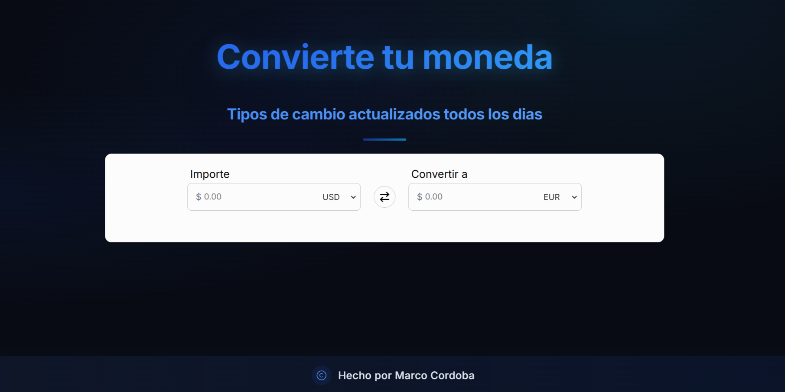

# Conversor de Monedas

Este es un proyecto de aplicación web que permite la conversión de monedas en tiempo real utilizando las tasas de cambio actuales. La aplicación está desarrollada con React y utiliza la API de ExchangeRate para obtener la información de las tasas de cambio.

## Características

- Conversión en tiempo real entre diferentes monedas
- Interfaz intuitiva y fácil de usar
- Actualización diaria de tasas de cambio
- Soporte para múltiples divisas internacionales
- Diseño responsive para diferentes dispositivos

## Tecnologías utilizadas

- React 19
- Vite 7
- API de ExchangeRate (v6)
- CSS personalizado

## Instalación

1. Clona este repositorio:
   ```
   git clone https://github.com/MarcoCordoba/Conversos-Monedas.git
   ```
2. Navega al directorio del proyecto:
   ```
   cd Conversos-Monedas
   ```
3. Instala las dependencias:
   ```
   npm install
   ```
4. Ejecuta la aplicación en modo desarrollo:
   ```
   npm run dev
   ```

## Vista previa



*[Aquí puedes agregar una captura de pantalla de la aplicación funcionando]*

## Funcionalidades

- Selección de moneda de origen y destino
- Ingreso de cantidad a convertir
- Visualización instantánea del resultado
- Botón para intercambiar monedas rápidamente

## Autor

- **Marco Córdoba** - *Desarrollo completo*
